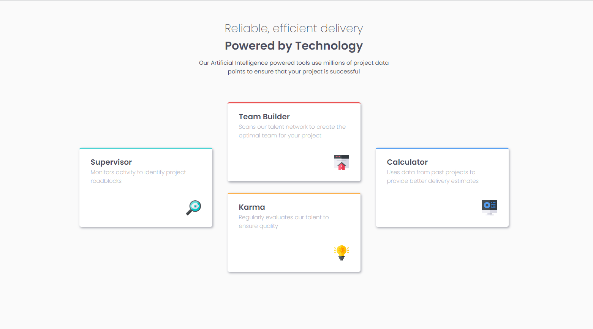

# Frontend Mentor - Four card feature section

[LIVE website](https://splendorous-sprinkles-2df4da.netlify.app/)

This is a solution to the [Four card feature section challenge on Frontend Mentor](https://www.frontendmentor.io/challenges/four-card-feature-section-weK1eFYK).  

### The challenge

Users should be able to:

- View the optimal layout for the site depending on their device's screen size

### Screenshot

### Links

- Live Site URL: [splendorous-sprinkles-2df4da.netlify.app](https://splendorous-sprinkles-2df4da.netlify.app/)

### Built with

- Semantic HTML5 markup
- SCSS custom properties
- Flexbox
- Mobile-first workflow

### What I learned

I learned how to create a card and a responsive design.